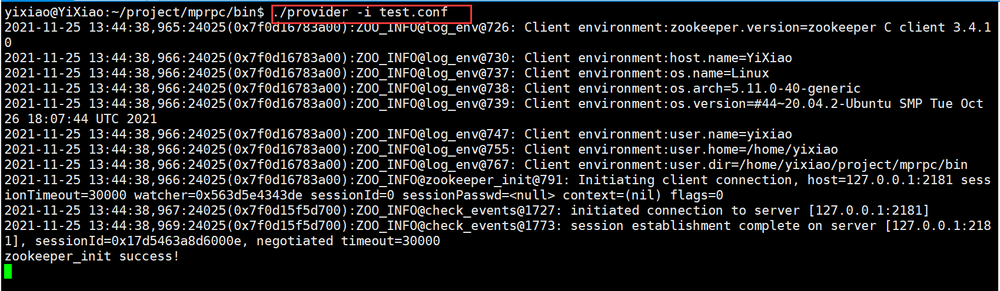
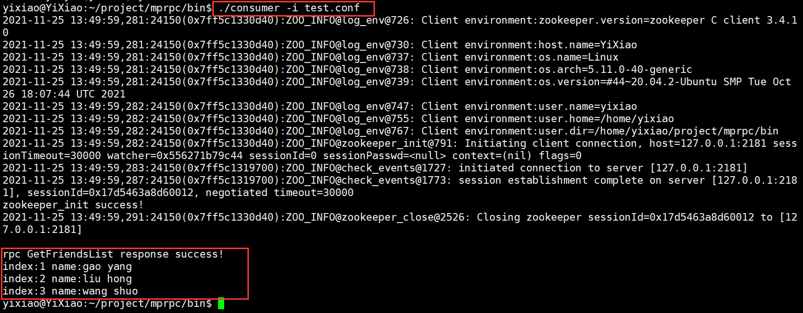
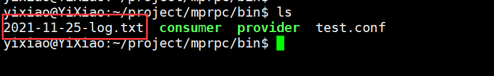
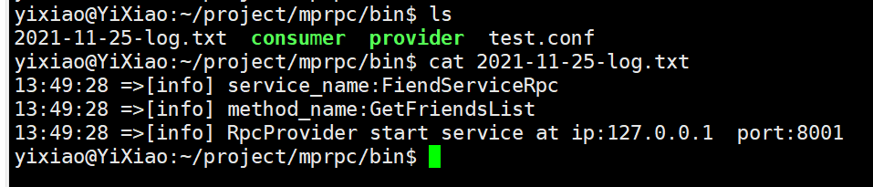

### mprpc框架简介

mprpc 是基于muduo 、protobuf和zookeeper 实现的。

在使用他，之前你需要先安装好muduo网络库、protobuf、zookeeper，并且生成zookeeper C 的原生API，当然还需要cmake工具

准备好环境之后，直接执行

```shell
./autobuild.sh
```

在lib目录下生成了 libmprpc.a 的静态库,include 下的所有头文件

并且在bin目录下生成示例可执行文件 provider 和 consumer 


需要配置一下 bin目录下的 test.conf,修改成自己zookeeper的端口和ip，默认是2181

```shell
#服务器执行
./provider -i test.conf
#客户端执行
。/consumer -i test.conf
```

如何发布rpc方法 可以参照 ```/example/callee```目录下```friendservice.cc```和```userservicer.cc```

如何使用rpc方法 可以参照```/example/caller```目录下```callfriendservice.cc```和```calluserservicer.cc```

以及其相对应的proto文件

结果展示





生成日志文件





感谢您的阅读和使用，也请您不吝赐教！
